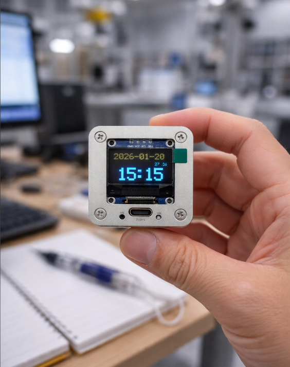

# PIX_Clock - ESP32-C3 Smart Clock


English | [中文](README.zh.md)

A smart clock project based on ESP32-C3, using DS3231 RTC module and SSD1306 OLED display, with WiFi provisioning and NTP time synchronization capabilities.



## ✨ Features

### Core Features
- ✅ **Precise Time Display**: Uses DS3231 RTC module for high-precision time (±2ppm accuracy)
- ✅ **OLED Display**: 128x64 pixel SSD1306 OLED display showing time, date, weekday, and temperature
- ✅ **WiFi Provisioning**: Supports SoftAP mode for easy WiFi configuration via web interface
- ✅ **NTP Time Synchronization**: Automatically syncs time from network to ensure accuracy
- ✅ **Low Power Design**: Intelligent WiFi module management, only enabled when needed
- ✅ **Button Control**: Long press button to quickly enter provisioning mode

### Display Features
- **Time Display**: Format `HH:MM` with blinking colon every second
- **Date Display**: Format `YYYY-MM-DD`
- **Weekday Display**: Shows current weekday (Sun/Mon/Tue/Wed/Thu/Fri/Sat)
- **Temperature Display**: Shows DS3231 built-in temperature sensor reading (format: `XX.Xc`)
- **Auto Brightness**: Automatically adjusts display brightness based on time period
  - Daytime (06:00-17:59): 100% brightness
  - Nighttime (18:00-05:59): 75% brightness
- **Burn-in Prevention**: Slightly shifts display position every 5 minutes to prevent OLED burn-in

## 🔌 Hardware Connections

### ESP32-C3 Pin Definitions

| ESP32-C3 Pin | Connection | Description |
|--------------|------------|-------------|
| GPIO0 | SDA | I2C data line (DS3231 + SSD1306) |
| GPIO1 | SCL | I2C clock line (DS3231 + SSD1306) |
| GPIO3 | BUTTON | Button (long press 3 seconds to enter provisioning mode) |
| VBUS | TP4096 Battery Input | Power input from TP4096 lithium battery charging module |

### Module Specifications

- **DS3231 RTC Module**
  - I2C Address: `0x68` (fixed)
  - Accuracy: ±2ppm (approximately ±1 minute/year)
  - Built-in temperature sensor
  - Backup battery support (CR2032)

- **SSD1306 OLED Display**
  - I2C Address: `0x3C` (common, automatically tries `0x3D`)
  - Resolution: 128x64 pixels
  - Display Type: Blue-yellow dual color (upper half yellow, lower half blue)

- **Power Supply**
  - **TP4096 Lithium Battery Charging Module**
    - Battery Input: Connected to ESP32-C3 VBUS pin
    - Charging Interface: Type-C port on the panel (for charging the lithium battery)
    - Battery Capacity: 850mAh lithium battery
    - Function: Provides portable power supply for the device

### Wiring Diagram

```
ESP32-C3          DS3231          SSD1306          TP4096
   GPIO0  ──────── SDA ──────────── SDA
   GPIO1  ──────── SCL ──────────── SCL
   GPIO3  ──────── BUTTON (button)
   VBUS   ──────── Battery Input (from TP4096)
   GND    ──────── GND ──────────── GND ──────────── GND
   3.3V   ──────── VCC ──────────── VCC

TP4096 Module:
   Battery Input ──── ESP32-C3 VBUS
   Type-C Port ────── Panel Type-C (for charging)
   850mAh Battery ──── Connected to TP4096
```

**Note**:
- I2C bus has internal pull-up resistors enabled
- If communication is unstable, external pull-up resistors (4.7kΩ) are recommended
- DS3231 requires backup battery (CR2032) to maintain time after power loss
- **Power Supply**: The device uses a TP4096 lithium battery charging module with an 850mAh battery
  - ESP32-C3 VBUS pin is connected to TP4096 battery output
  - Type-C port on the panel is used for charging the lithium battery
  - The device can operate on battery power, making it portable

## 🚀 Build and Flash

### Requirements

- ESP-IDF v5.0 or higher
- CMake 3.16 or higher
- Python 3.6 or higher

### Build Steps

```bash
# Set up ESP-IDF environment (if not already set)
. $HOME/esp/esp-idf/export.sh
# Windows: .\esp-idf\export.bat

# Enter project directory
cd PIX_Clock

# Configure project (optional, uses default config)
idf.py menuconfig

# Build project
idf.py build

# Flash to device
idf.py flash

# View serial output
idf.py monitor
# Or use Ctrl+] to exit monitor
```

### One-Command Build and Flash

```bash
idf.py flash monitor
```

## 📶 WiFi Provisioning

### First Use (Auto Provisioning)

1. After power-on, if no saved WiFi configuration exists, the device **automatically enters provisioning mode**
2. The device creates a WiFi hotspot named `VFD_Clock_Setup`
3. Connect to the hotspot using a phone or computer
   - **SSID**: `VFD_Clock_Setup`
   - **Password**: `12345678`
4. Open a browser and visit `http://192.168.4.1`
5. Enter your WiFi information on the provisioning page:
   - WiFi name (SSID)
   - WiFi password
6. Click the "Connect" button
7. The device automatically saves the configuration and connects to your specified WiFi network
8. After successful connection, the device disconnects the provisioning hotspot and starts NTP time synchronization

### Button Provisioning (Recommended)

If you need to reconfigure WiFi or change networks:

1. **Long press GPIO3 button for 3 seconds**
2. The device immediately enters provisioning mode
3. **Important**: Button long press will **clear old WiFi configuration** (forced reset)
4. Follow steps 3-8 above to complete provisioning
5. **Important**: Provisioning triggered by button will **force NTP time synchronization** after successful connection (ignoring 720-hour limit) to ensure time accuracy

### Auto Re-provisioning

If WiFi connection fails (all 5 retries fail), the device will:

1. Automatically clear old invalid configuration
2. Enter provisioning mode
3. Wait for user to reconfigure WiFi

## ⏰ NTP Time Synchronization

### Synchronization Strategy

- **Default Interval**: Sync every 720 hours (30 days)
- **Smart Detection**: If synced within 720 hours, **WiFi module will not start**, saving power
- **Forced Sync**: Button provisioning triggers forced sync (ignoring time limit)
- **Sync Timeout**: Close WiFi if sync fails within 60 seconds

### NTP Servers

- Primary Server: `cn.pool.ntp.org`
- Backup Server: `time.windows.com`
- Backup Server: `pool.ntp.org`

### Timezone Settings

- Default Timezone: **CST-8 (UTC+8, Beijing Time)**
- Timezone is set immediately at system startup
- All time display and calculations are based on local time

### Time Synchronization Flow

1. Check if synchronization is needed (based on last sync timestamp)
2. If needed, start WiFi and connect
3. After WiFi connection succeeds, initialize SNTP client
4. Wait for NTP server response (up to 60 seconds)
5. After successful sync, update DS3231 RTC time
6. Save sync timestamp to NVS
7. Close WiFi to save power

## 🔋 Low Power Design

### Power Optimization Strategy

1. **WiFi Intelligent Management**:
   - WiFi only enabled when NTP sync or provisioning is needed
   - If sync is not needed (synced within 720 hours), WiFi module does not start at all
   - WiFi is closed immediately after NTP sync completes

2. **DS3231 RTC Time Keeping**:
   - Uses high-precision RTC module to maintain time
   - Backup battery maintains time after power loss
   - Works normally without WiFi

3. **Display Optimization**:
   - Automatically adjusts brightness based on time period
   - Reduces brightness at night to save power

## 🎛️ Button Functions

### GPIO3 Button

- **Function**: Long press 3 seconds to enter provisioning mode
- **Features**:
  - Can be triggered at any time (main loop continuously detects)
  - Clears old WiFi configuration after trigger
  - Forces NTP synchronization after successful provisioning
  - Responsive, no waiting required

### Button Detection Mechanism

- Uses GPIO interrupt to detect button state
- Detects long press duration (3 seconds) in main loop
- Supports both rising and falling edge triggers

## 📁 Project Structure

```
PIX_Clock/
├── CMakeLists.txt                    # Project-level CMakeLists
├── main/
│   ├── CMakeLists.txt                # Main directory CMakeLists
│   ├── main.c                        # Main program
│   └── lib/
│       ├── ds3231/                   # DS3231 driver
│       │   ├── ds3231.h
│       │   └── ds3231_driver.c
│       ├── ssd1306/                  # SSD1306 driver
│       │   ├── ssd1306.h
│       │   └── ssd1306.c
│       └── wifi_provisioning/        # WiFi provisioning module
│           ├── wifi_provisioning.h
│           └── wifi_provisioning.c
├── sdkconfig                         # ESP-IDF configuration file
└── README.md                         # Project documentation
```

## 🔧 Technical Details

### I2C Bus Configuration

- **Bus Sharing**: DS3231 and SSD1306 share the same I2C bus
- **Device Addresses**:
  - DS3231: `0x68` (fixed)
  - SSD1306: `0x3C` (automatically tries `0x3D`)
- **Bus Speed**:
  - DS3231: 100kHz
  - SSD1306: 400kHz
- **Pull-up Resistors**: Internal pull-ups enabled

### WiFi Connection Retry Mechanism

- **Max Retries**: 5 times
- **Retry Interval**: 15 seconds
- **Diagnostic Feature**: Automatically scans available WiFi networks on first failure
- **Failure Handling**: After 5 failures, automatically clears configuration and enters provisioning mode

### NVS Storage

The project uses two independent NVS namespaces:

- **`wifi_config`**: Stores WiFi configuration (SSID and password)
- **`time_sync`**: Stores last NTP sync timestamp

Namespace isolation ensures they don't affect each other.

### Display Refresh Mechanism

- **Refresh Rate**: Updates display every second
- **Time Reading**: Reads time from DS3231 RTC
- **Display Content**: Time, date, weekday, temperature
- **Pixel Shift**: Cycles through 8 positions every 5 minutes

## ⚠️ Notes

1. **I2C Address**:
   - If SSD1306 cannot communicate at `0x3C` address, code automatically tries `0x3D`
   - If both addresses fail, system continues running but without display (serial output shows error)

2. **Pull-up Resistors**:
   - I2C bus has internal pull-ups enabled
   - If communication is unstable, external pull-up resistors (4.7kΩ) are recommended

3. **DS3231 Backup Battery**:
   - CR2032 backup battery installation is recommended
   - Backup battery maintains time after power loss
   - Without backup battery, time will be lost after power loss

4. **WiFi Configuration**:
   - WiFi configuration is saved in NVS and persists after power loss
   - Clearing configuration requires button long press or re-provisioning

5. **Time Synchronization**:
   - First use requires WiFi configuration to sync time
   - If WiFi is not configured or connection fails, device uses current DS3231 time
   - Manual DS3231 time setting is recommended before first use (if possible)

6. **Display Effect**:
   - 128x64 blue-yellow dual-color OLED, upper half (rows 0-31) yellow, lower half (rows 32-63) blue
   - Time uses 2x size font, center-aligned
   - Date, weekday, temperature use 1x size font

## 🐛 Troubleshooting

### Issue: Cannot Connect to WiFi

**Solutions**:
1. Check if WiFi name and password are correct
2. Confirm router supports 2.4GHz band (ESP32-C3 does not support 5GHz)
3. Check if router has MAC address filtering enabled
4. Check serial output WiFi scan results to confirm if target SSID is in the list

### Issue: Time Display Inaccurate

**Solutions**:
1. Check if DS3231 is working properly (check serial logs)
2. Confirm WiFi is connected and NTP time sync succeeded
3. Check if timezone setting is correct (default UTC+8)
4. If not synced for a long time, use button long press to force sync

### Issue: OLED Display Shows Nothing

**Solutions**:
1. Check if I2C connections are correct (SDA, SCL, GND, VCC)
2. Check serial logs to confirm if SSD1306 initialized successfully
3. Try modifying I2C address in code (`0x3C` or `0x3D`)
4. Check if display is damaged (try another SSD1306 module)

### Issue: Button Not Responding

**Solutions**:
1. Check if button connection is correct (GPIO3)
2. Confirm button press is low level (code has pull-up enabled)
3. Check if button is damaged
4. Check serial logs to confirm if GPIO initialization succeeded

## 📝 Changelog

### v1.0.0 (Current Version)

- ✅ Implemented DS3231 RTC time reading and display
- ✅ Implemented SSD1306 OLED display functionality
- ✅ Implemented WiFi provisioning (SoftAP mode)
- ✅ Implemented NTP time synchronization
- ✅ Implemented button long press provisioning
- ✅ Implemented auto brightness adjustment
- ✅ Implemented pixel shift burn-in prevention
- ✅ Implemented low power design (intelligent WiFi management)

## 📄 License

This project is developed based on ESP-IDF and follows the corresponding open source license.

## 🙏 Acknowledgments

- ESP-IDF development framework
- DS3231 RTC module
- SSD1306 OLED display

---

**Project Name**: PIX_Clock  
**Hardware Platform**: ESP32-C3  
**Development Framework**: ESP-IDF v5.0+  
**Last Updated**: 2024
